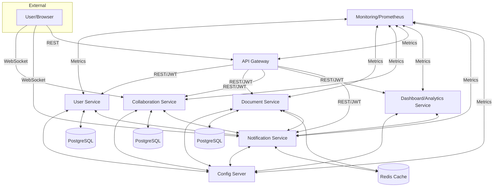

# Collaborative Document System - Architecture Summary

## Overview
A modern, AI-ready, microservices-based collaborative document editing platform inspired by Google Docs. Built with Java, Spring Boot, and Spring Cloud, supporting real-time collaboration, versioning, sharing, and robust DevOps/monitoring.

## System Data Flow Diagram


---

## Services
- **user-service**: User registration, login, JWT authentication, profile management
- **document-service**: Document CRUD, versioning, sharing (by username/email), search
- **collaboration-service**: Real-time editing via WebSocket, session tracking, operational transformation (stub)
- **gateway**: API Gateway (Spring Cloud Gateway), JWT validation, rate limiting, CORS
- **config**: Centralized configuration server (Spring Cloud Config)
- **monitoring**: Metrics, health, Prometheus, sample Grafana dashboard
- **registry**: (Optional) Service discovery (Eureka/Consul ready)
- **shared**: Common models/utilities (future use)

---

## Integration Patterns
- **REST**: Synchronous service-to-service communication
- **JWT**: Stateless authentication, validated at gateway and services
- **Service Discovery**: Dynamic routing (Eureka/Consul, optional)
- **Event-Driven**: Ready for real-time/events (future Kafka/Redis)
- **Centralized Config**: All configs managed via config server
- **API Gateway**: Unified entry, security, and cross-cutting concerns

---

## DevOps & Monitoring
- **Docker Compose**: Orchestrates all services, PostgreSQL, Redis
- **Prometheus & Grafana**: Metrics and dashboards (see `monitoring/monitoring/src/main/resources/prometheus-dashboard.json`)
- **Actuator**: Health and metrics endpoints enabled

---

## How to Run
1. **Build all services:**
   ```sh
   mvn clean package
   ```
2. **Start with Docker Compose:**
   ```sh
   docker-compose up --build
   ```
3. **Access APIs:**
   - Gateway: [http://localhost:8085](http://localhost:8085)
   - Swagger UI: `/swagger-ui.html` on each service
   - Monitoring: [http://localhost:8090/actuator/prometheus](http://localhost:8090/actuator/prometheus)
   - Config Server: [http://localhost:8888](http://localhost:8888)

---

## Extending the System
- Add AI features (recommendations, summarization, etc.)
- Integrate with external identity providers (OAuth2, SSO)
- Add more event-driven workflows (Kafka, Redis Streams)
- Enhance operational transformation for real-time editing

---

**This file is auto-generated. For questions or further customization, see the project README or contact the architecture team.** 